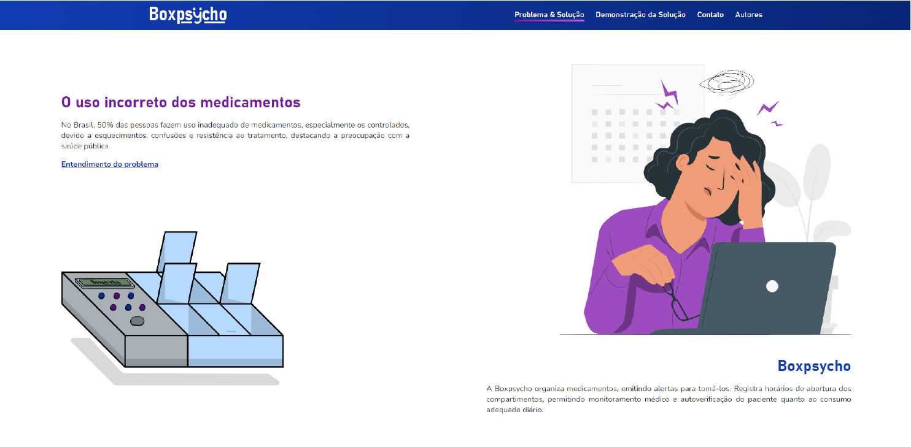
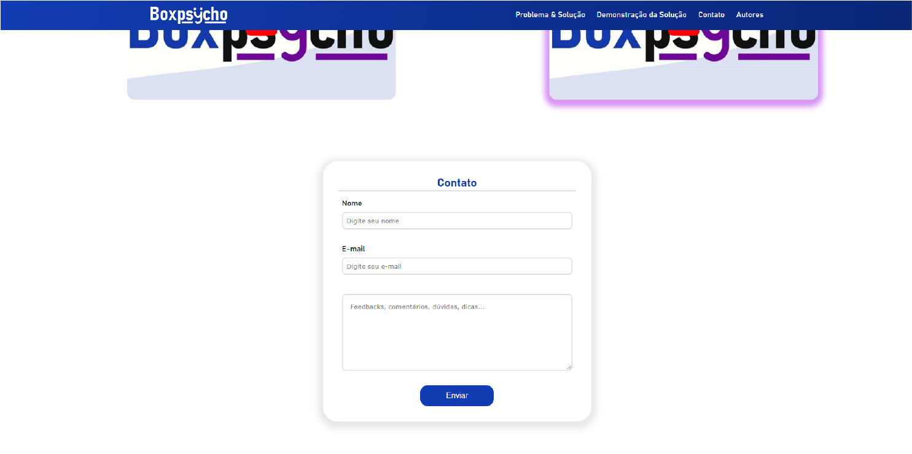
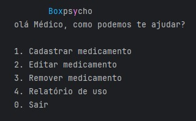
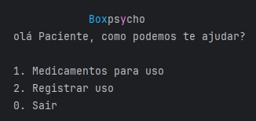
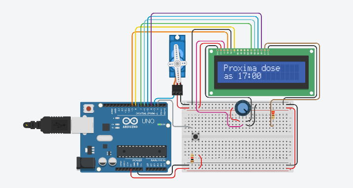
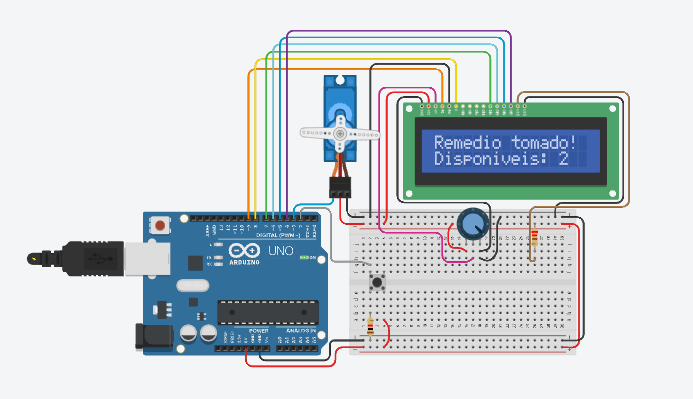

<!-- README PADRONIZADO DO DIEGO CRIVELARO ❤ -->

<h4 align="center">Protótipo</h4>

Projeto desenvolvido para a Global Solution, uma parceria feita entre a FIAP e a Notredame Intermédica, que visa lidar com a Inovação e Tecnologia Moldando o Futuro da Saúde: Prevenção, Automação e Precisão.

  
  
  
  
  

---

# 📖 Índice
* <a href="#✅-features">✅ Features</a>
* <a href="#🖼-demonstração">🖼 Demonstração</a>
* <a href="#🚀-como-executar-o-projeto">🚀 Como executar o projeto</a>
  * <a href="#📑-pré-requisitos">📑 Pré-requisitos</a>
* <a href="#⚡-tecnologias">⚡ Tecnologias</a>
* <a href="#👨‍💻-autores">👨‍💻 Contribuidores</a>
* <a href="#📝-licença">📝 Licença</a>

---
## ✅ Features 
- [X] Site de demonsrtração do projeto
- [X] Cadastro de medicamentos
- [X] Aviso dos horarios que o medicamento deve ser tomado
- [X] Relaório de uso de medicametos
- [ ] Sincronização entre python e arduino
---
## 🖼 Demonstração
  
  [HTML/CSS/JS](https://jorgebooz00.github.io/boxpsycho-site/)
  |  |  |
  |-|-|

    
    
  

  [Python](https://www.youtube.com/watch?v=QJ0pS9f6Pm8)
  

    
    

  ---
  

  [Arduino](https://youtu.be/6CkvKPpidmY)
  

    
    
  

---

## 🚀 Como executar o projeto
  [Site](https://jorgebooz00.github.io/boxpsycho-site/)

  [Python](https://github.com/JorgeBooz00/gs-boxpsycho/tree/132cba88f07f546aacbe14d84bdc3f38957394fe/computational%20thinking%20using%20python)
  

  [Arduino](https://github.com/JorgeBooz00/gs-boxpsycho/tree/132cba88f07f546aacbe14d84bdc3f38957394fe/edge%20computing%20%26%20computing%20systems)

### 📑 Pré-requisitos
  Python 3.10 ou superior e Tinkercad
---

## ⚡ Tecnologias
As seguintes tecnologias foram usadas na construção do projeto:

- [X] Arduino
- [X] HTML/CSS/JAVASCRIP
- [X] python 3.10+
---

## 👨‍💻 Autores
Feita com muita vontade de aprender por:
<table alig="center">
  <tr>
    <td align="center"><a href="https://github.com/JorgeBooz00"> <b>Jorge Booz</b></a> </td>
  </tr>
    <tr>
    <td align="center"><a href="https://github.com/MateusTibao"> <b>Mateus Tibão</b></a> </td>
  </tr>
</table>

---

## 📝 Licença
Este projeto está sobe a licença <a href="LICENCE">MIT</a>

---
