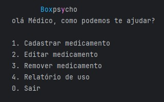
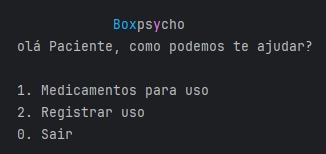

 

<h1 align="center">
    
</h1>

<h4 align="center"> 
	🚧  Boxpsycho 🙂 Protótipo 🚀 🚧
</h4>

  [Sobre](#sobre) • [Funcionalidades](#funcionalidades) • [Layout](#layout) • [Futuras](#futuras) • [Vídeos](#video) •[Execução](#exec) • [Pré-requisitos](#quests) • [Tecnologia](#tech) • [Autores](#lindoes) • [Autores](#license) •

## 💻 Sobre o projeto 

🙂 Boxpsycho - é uma caixa de remédios para o controle dos médicos e seus pacientes sobre suas medicações

Projeto desenvolvido durante a **Global Solution** parceiria feita entre [FIAP](https://www.fiap.com.br/) e [Hapvida](https://www.hapvida.com.br/site/).
a GS é uma experiência hands on com muito conteúdo prático, desafios proposto a todos os alunos durante duas semanas.

---

## ⚙️ Funcionalidades 

- [x] Médicos cadastram medicações, a dose que deve ser tomada e o horário de uso:
  - [x] feito passo a passo em python
  - [x] adicione o nome da medicação, a dose e horário que devem ser consumidas
  - [x] após o uso do paciente o médico pode pedir um relatório que é gerado automaticamente das medicações usadas

- [x] Os usuários podem ver as medicações que devem tomar e registrar o seu uso 
  - [x] escolher a opção de Medicamentos para uso
  - [x] escolher a opção de Registrar uso

---

## 🎨 Layout  

feito completamente no output do python.

  
  

#teste

### Funcionalidades Futuras 

- [x] Receber o registro do medicamento de um arquivo vindo do arduino
- [x] Registro de uso enciado por e-mail para o doutor

---
### Vídeos 
[Pitch do projeto](https://youtu.be/V1doqEqW1uU)

[Vídeo funcionando](https://youtu.be/QJ0pS9f6Pm8)

---

## 🚀 Como executar o projeto 

Este projeto é feita puramente em python:
1. Abra uma IDE de python
2. Execute o projeto sem mexer em nenhuma linha

### Pré-requisitos 

Antes de começar, você vai precisar ter instalado em sua máquina as seguintes ferramentas:
[Python 3.10 ou superior](https://www.python.org/downloads/) e uma IDE de python, recomendamos o [PyCharm](https://www.jetbrains.com/edu-products/download/other-PCE.html)

## 🛠 Tecnologias 

As seguintes ferramentas foram usadas na construção do projeto:

#### **Python**  

-   **Módulo Time**
-   **Estruturação do código**

#### **Arduino** 
-   **Linguagem C++**
-   **Placa Arduino**
-   **Servo Motor**
-   **Display LCD**
-   **Buzzer**
-   **Botão**

---

## 🦸 Autores 

<a href="https://github.com/JorgeBooz00">
 
  
 <b>Jorge Booz</b>  <b>RM 552700</b></a> <a href="https://github.com/JorgeBooz00" title="Booz">🚀</a>
   <a href="https://github.com/MateusTibao">
 
  
 <b>Mateus Tibao</b>  <b>RM 553267</b></a> <a href="https://github.com/MateusTibao" title="Tibao">🚀</a>
  

 

---

## 📝 Licença 

Este projeto esta sobe a licença [MIT](./LICENSE).

Feito com muita vontade de aprender por [Jorge Booz](https://www.linkedin.com/in/jorge-booz-4038a2213/) e [Mateus Tibão](https://www.linkedin.com/in/mateustibao/) 👋🏽 

---
